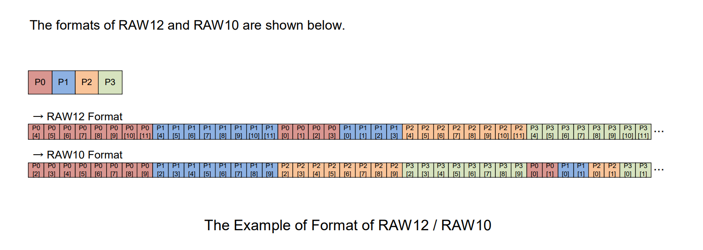
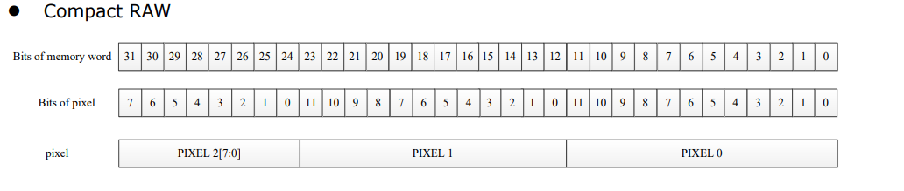

## Overview

This small tool converts the inconvenient raw data format on the Raspberry Pi, jetson and Rockchip platforms into a format that is easier for algorithms and display software to handle, which is unpacked Y10 or Y12.
Note that not everyone needs this tool. It is basically just for the machine vision camera products produced by [www.veye.cc](http://www.veye.cc "www.veye.cc").

### Usage

#### make

```
git clone https://github.com/veyeimaging/pixel_layer_convert.git
make
```

#### usage

- For Jetson raw data

```
./pixel_layer_convert -I [input format] -i [inputfile] -o [outputfile]
```
The input format should be : XY10,XY12,TY10,TY12.

- For Raspberrypi packed raw data
The effective width of the image must be specified.
```
./pixel_layer_convert -I [input format] -w [image width] -i [inputfile] -o [outputfile]
```
The input format should be : Y10P,Y12P.

- For Rockchip compact raw data
The effective width of the image must be specified.
```
./pixel_layer_convert -I [input format] -w [image width] -i [inputfile] -o [outputfile]
```
The input format should be : R10C,R12C.

- General Instructions

The input and output formats are FourCC, which are listed below. The output format will automatically match the input format.

This tool does not require the width and height as parameters and will complete the conversion as much as possible.

The converted files can be easily opened using [vooya](https://www.offminor.de/ "vooya").

Note: The input format parameter is case-insensitive.

- Special instructions for the Raspberry Pi packed format

Packed format Buffersize= ALIGN_UP（width*bit_depth/8,32）*ALIGN_UP(height,16).

The row buffer size should be 32 bytes aligned,the column buffer size should be 16bytes aligned.

The effective width of the image must be specified.

This program discards the padded bytes in processing and processes only valid data.

- Special instructions for the Rockchip RK3588 Compact format

Packed format Line Buffersize= ALIGN_UP（width*bit_depth/8,256）

The row buffer size should be 256 bytes aligned.

The effective width of the image must be specified.

This program discards the padded bytes in processing and processes only valid data.

### input format

- Jetson Xavier

| Depth | Bit order (X is undefined) | FourCC |
| --- | --- | --- |
| 10 | 0 B9 B8 B7 B6 B5 B4 B3 B2 B1 B0 X X X X X | XY10 |
| 12 | 0 B11 B10 B9 B8 B7 B6 B5 B4 B3 B2 B1 B0 X X X | XY12 |

- Jetson TX2

| Depth | Bit order (X is undefined) | FourCC |
| --- | --- | --- |
| 10 | 0 0 B9 B8 B7 B6 B5 B4 B3 B2 B1 B0 X X X X | TY10 |
| 12 | 0 0 B11 B10 B9 B8 B7 B6 B5 B4 B3 B2 B1 B0 X X | TY12 |

- Raspberrypi mipi packed mode



- Rockchip Compact format


### output format
The ouput unpacked format, i.e., using two bytes to store one pixel of data.
The valid data is filled in the lowest bit first, and the high bit that cannot be used is filled with 0.

| Depth | Bit order  | FourCC |
| --- | --- | --- |
| 10 | 0 0 0 0 0 0 B9 B8 B7 B6 B5 B4 B3 B2 B1 B0| 'Y10 ' |
| 12 | 0 0 0 0 B11 B10 B9 B8 B7 B6 B5 B4 B3 B2 B1 B0 | 'Y12 ' |
